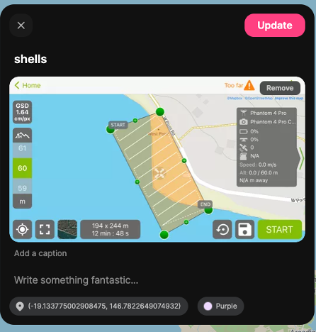

# Drone Mapping 101

## Please download Pix4DCapture on your phone
For Android users:

Scan: 

For iOS users:

Scan: 

Once you've finished your own map planning

## Upload your mapping mission

Got to [Padlet](https://padlet.com/joanli/dronemapping101).

Or scan 

Add a pin near your area of interest and put your target object in the title, then upload the screenshot

